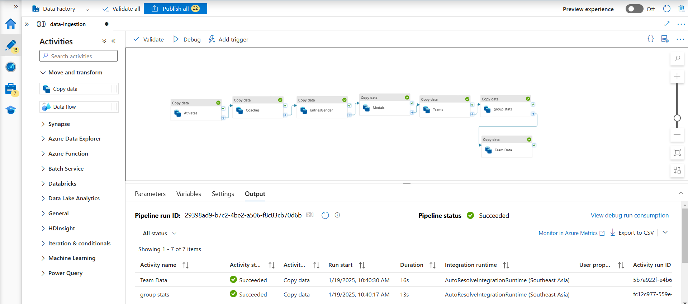
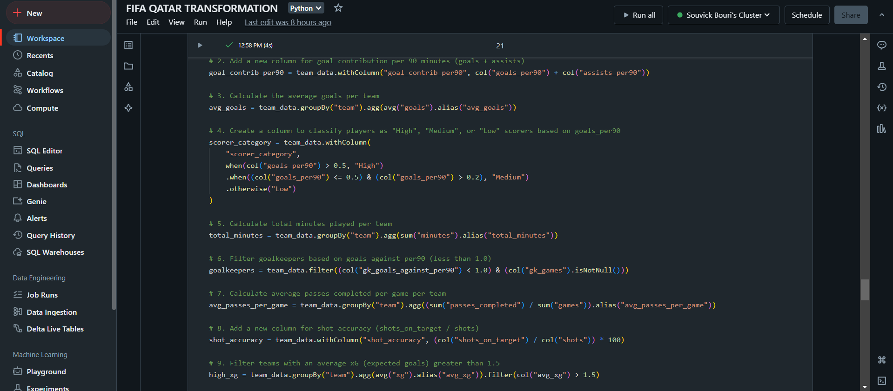
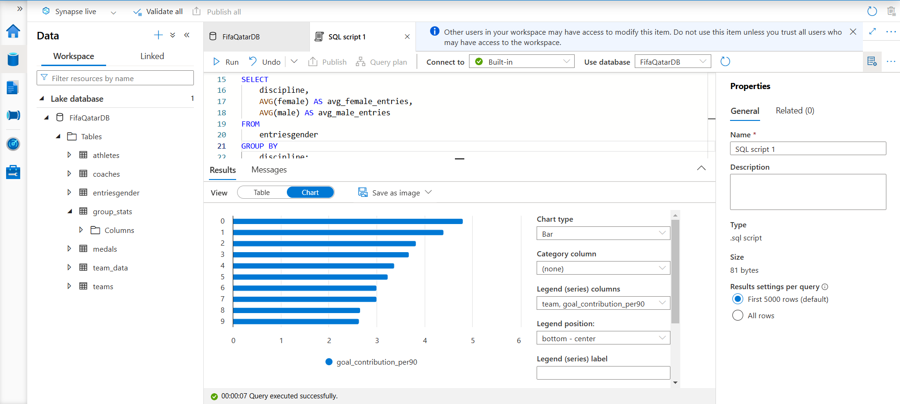

# Azure FIFA Qatar Data Engineering Project ⚽

Welcome to the **FIFA Qatar Data Engineering Project** repository! 🚀 This project demonstrates a complete end-to-end data pipeline using Azure services. It includes data ingestion, transformation, and analytics with a focus on showcasing the power of Azure Data Factory, Databricks, Synapse Analytics, and Data Lake Gen2.

---

## 🌟 Project Architecture

```plaintext
Data Source (Kaggle) 
   ⇨ Data Ingestion (Data Factory) 
      ⇨ Raw Data Store (Data Lake Gen2) 
         ⇨ Transformation (Azure Databricks) 
            ⇨ Transformed Data (Data Lake Gen2) 
               ⇨ Analytics (Synapse Analytics) 
                  ⇨ Dashboard (Power BI)
```

---

## 🔧 Technologies Used

- **Azure Data Factory** for data ingestion.
- **Azure Data Lake Gen2** for raw and transformed data storage.
- **Azure Databricks** for data transformation using Apache Spark.
- **Azure Synapse Analytics** for querying and analyzing data.
- **Power BI** for interactive dashboards and visualizations.

---

## 🚀 Steps Implemented

### 1. Data Ingestion with Azure Data Factory

- Configured pipelines to copy raw data from Kaggle (GitHub raw CSVs) to Azure Data Lake Gen2.
- Created linked services for both HTTP sources and Azure Data Lake Gen2.
- Stored data in the `raw` folder within the Data Lake.


### 2. Data Transformation with Azure Databricks

- Mounted Azure Data Lake Gen2 storage to Databricks.
- Transformed datasets:
  - Changed data types (e.g., strings to integers).
  - Performed aggregations, groupings, and averages.
  - Partitioned and saved transformed data back to Data Lake Gen2.


### 3. Data Analysis with Synapse Analytics

- Created external tables in Synapse Analytics pointing to transformed data.
- Queried data using SQL scripts to extract meaningful insights.
- Used Synapse's inbuilt visualization tools for quick insights.


### 4. Visualization with Power BI

- Connected Power BI to Synapse Analytics using serverless SQL endpoints.
- Built interactive dashboards to visualize player performance, team statistics, and more.

---

## 🏆 Key Features

- **End-to-End Pipeline:** Covers the entire data lifecycle from ingestion to visualization.
- **Scalable Architecture:** Designed using Azure’s scalable cloud services.
- **Interactive Visualizations:** Insights displayed using Power BI dashboards.

---

## 📂 Repository Structure

- `data-ingestion/`: Contains Data Factory pipeline configurations.
- `data-transformation/`: Databricks notebooks for data processing.
- `data-analysis/`: SQL scripts used in Synapse Analytics.
- `dashboards/`: Power BI files for visualization.

---

## 💡 Lessons Learned

- Integration of multiple Azure services for a seamless data engineering workflow.
- Hands-on experience with Spark for data transformation.
- Leveraging Synapse Analytics for scalable query performance.

---

## 📸 Screenshots

### Azure Data Factory Pipeline



### Azure Databricks Transformation



### Synapse Analytics SQL Scripts



---


**Thank you for visiting this repository! Hope you find this project insightful. 🌟**
